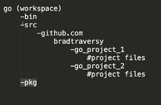

# Go/GoLang Crash Course

## Basic commands

* **go version** - check go version
* **go help** - check go help commands
* **go get** - get go packages
* **go env** - go environment

## Go Workspace

## Run commands

* **go run file.go** 

## Data Types

### Main types    
* string
* bool
* int
* int int8 int16 int32 int64
* uint uint8 uint16 uint32 uint64 uintptr
* byte - alias for uint8
* rune - alias for int32
* float32 float64
* complex64 complex128